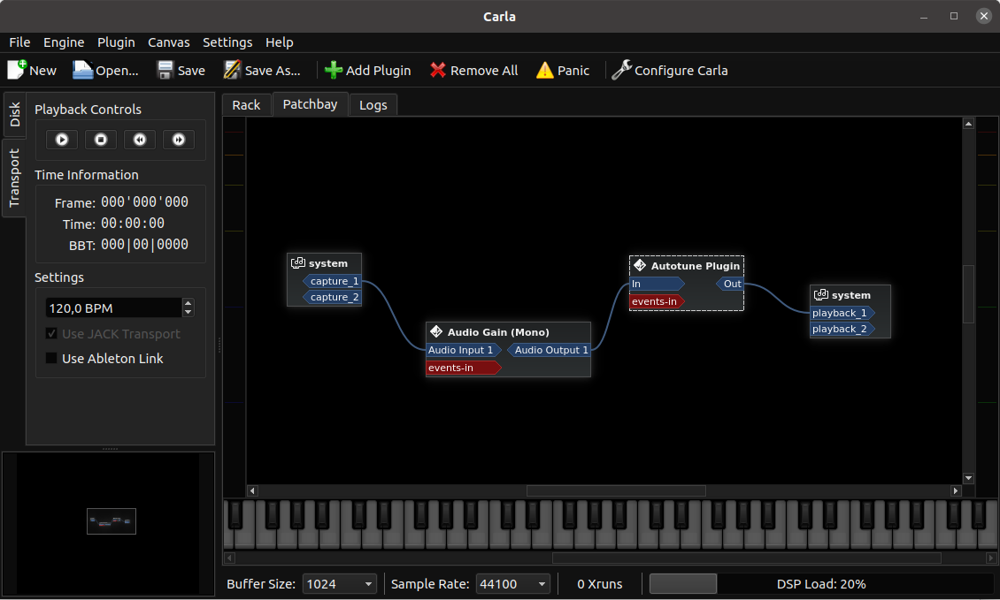

A collection of audio plugins using the [LV2](https://lv2plug.in/) (aka LADSPA version 2) standard.


Status
------

This is a work in progress, I'm still figuring out how to code user interfaces


How to build :
---------

The following dependencies should be installed : sudo apt install g++ make cmake lv2-dev

```
mkdir build
cd build 
cmake ..
cmake --build .
cmake --install .
```

The compiled plugins will be copied into your ~/.lv2/ folder, ready to be tested.

Smoke tests on .wav files
--------------------------

It is possible to apply some of the plugins on audio files using the [lv2file](https://github.com/jeremysalwen/lv2file) utility (sudo apt-get install lilv-utils lv2file)

```
lv2file -m -i ../examples/my_song.wav -o out.wav https://github.com/jrialland/lv2plugins/autopitch && aplay out.wav
```


Test with carla
---------------

[Carla](https://github.com/falkTX/Carla) is a lv2-enabled audio plugins host for linux, that relies on [jack](https://jackaudio.org/).

In order to test one of the plugins with carla :

1/ Start jackd, i.e by running qjackctl and clicking the 'Start' button

```
qjackctl &
```


2/ run `carla`, and setup the plugins :



The screenshot shows the 'AutoPitch' plugin wired from the mic input and into the speakers. In this configuration the plugin is applied 'live' on my voice, leading to a lot of fun.

Plugins
-------

* Autopitch : slightly changes the pitch of voices, so you can sound like Cher
